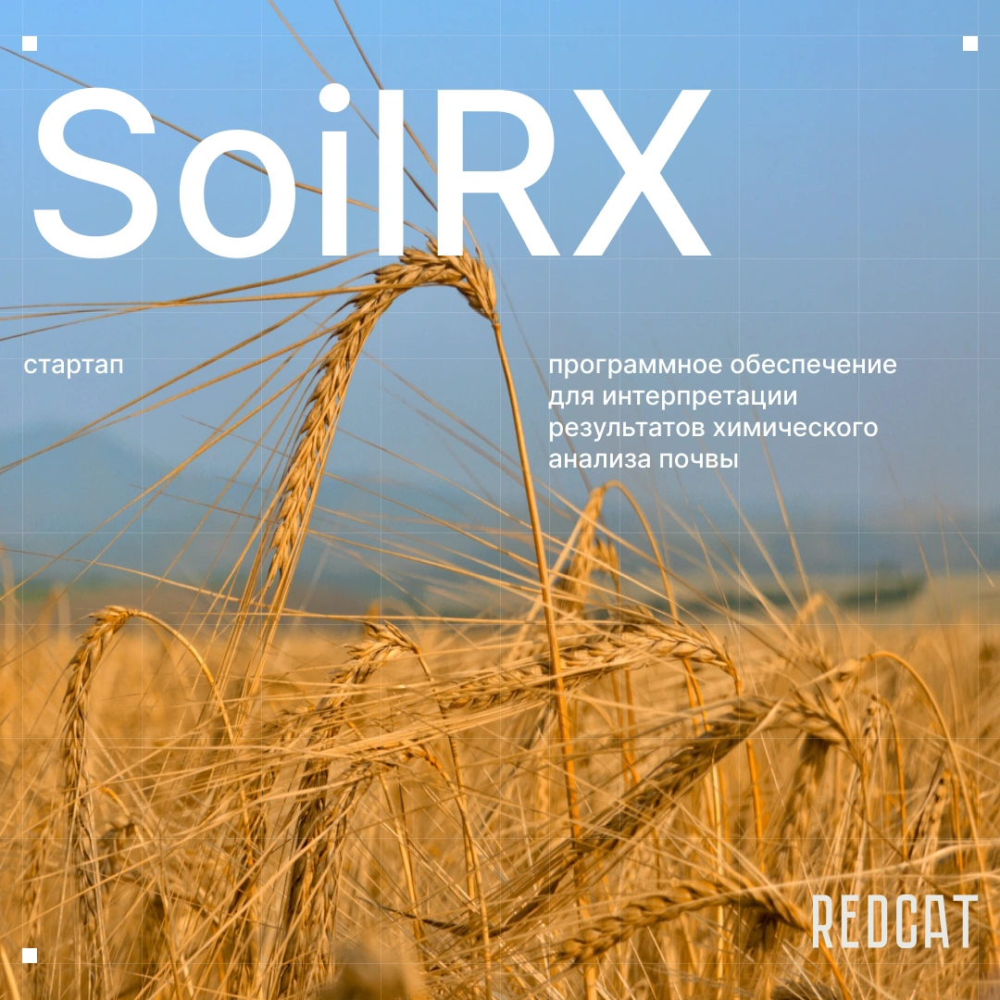

<h1>Бэкенд часть приложения soilrx разрабатываемая на стажировке для выдачи рекомендаций агрономам</h1>

<h3>
 На проекте были использованны такие технологии как:
 Docker 
 Laravel 
 Swagger 
 Postman 
 Pgsql 
</h3>
